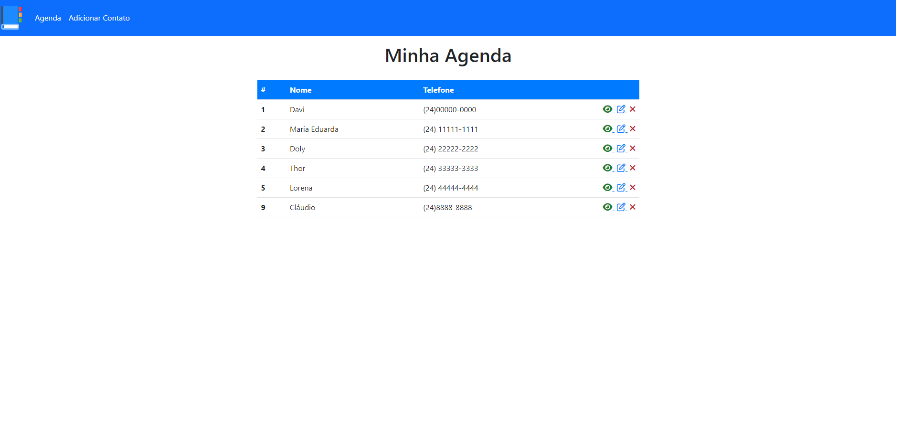
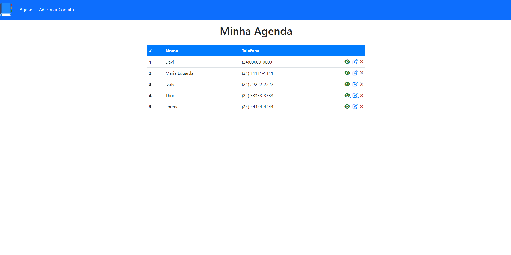
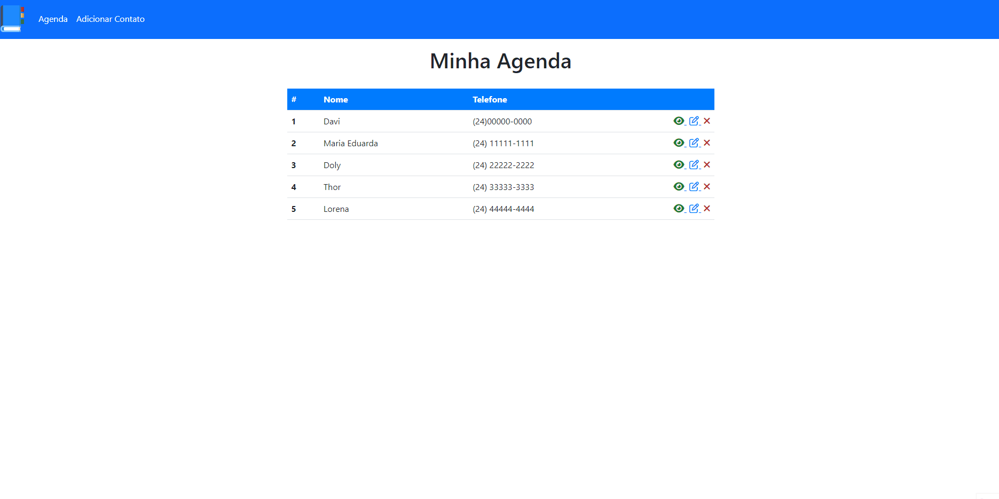
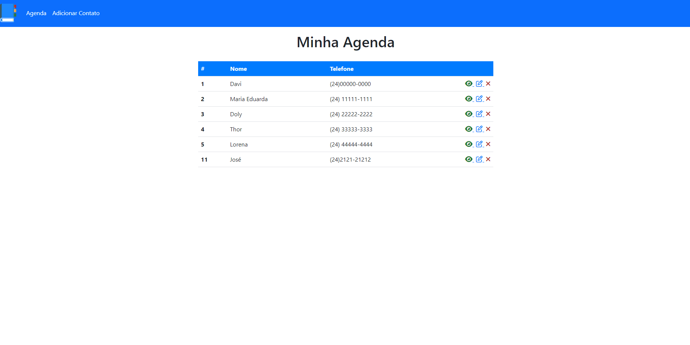
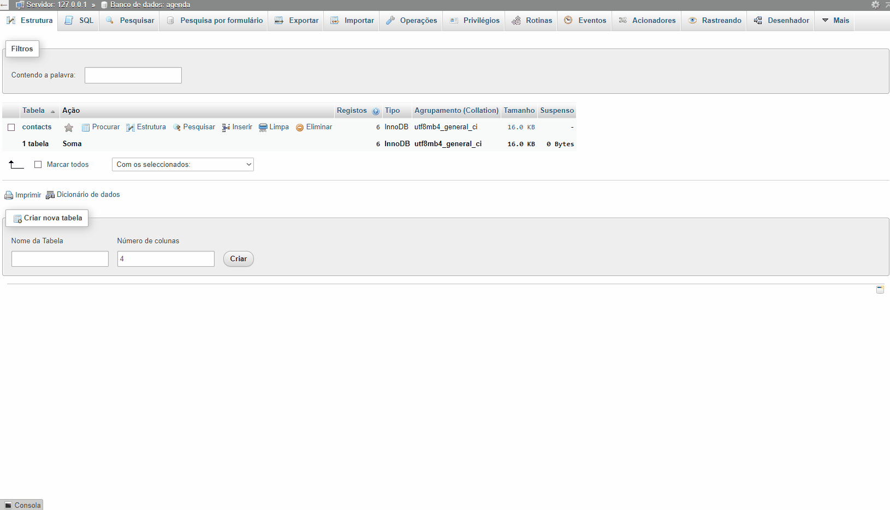

# Seja bem vindo à minha Agenda!
<!--  -->

# Sobre o projeto:

    Esta é uma agenda feita totalmente em PHP, e funcional. Como banco para realizar todas as operações do CRUD foi usado o MySql! E nesse projeto você pode adicionar contatos, deletar o contato que fica te enchendo o saco às 22 horas da noite, visualizar o contato para ver a descrição que você fez sobre ele e também pode editar qualquer informação sobre este contato.

# Agora seguem uns gifs mostrando o projeto!

<h2>Primeiro vamos dar uma olhada geral nele!</h2>

  

<h2>Agora vamos dar uma olhada em como é para adicionar um novo contado no projeto.</h2>

  

<h2>Agora vamos editar e visualizar um contato!</h2>

  

<h2>E por fim vamos ver como é deletado um contato neste projeto!</h2>

  

# Agora falando um pouco sobre a estrutura do DB desse projeto...

Como já foi falado, esse projeto foi construído em cima de MySql. E as linhas que compõe a tabela contacts são as seguintes.

Primeiramente temos o <strong>Id</strong>, que é o valor mais importante para este banco de dados. Através dele é possível realizar todas as operações do CRUD sem erros. Este Id é primeiramente uma primary key para destacar ele como um valor sempre único, impossibilitando ele de se repetir na tabela. Para além disso o Id também é unsigned para evitar que ele receba um valor negativo. E por fim vale destacar que ele é auto_increment, para que sempre que um contato novo seja criado, ele receba um id com um valor que sucede o anterior a ele. 

Já os outros campos desta tabela são mais simples, pois tem apenas a finalidade de serem informações sobre o contato em questão. Com isso poderemos ter contatos com nomes exatamente iguais que o DB vai aceitar. Os outros campos são:<strong>name, phone e observations</strong>.

<h2>Agora segue um gif mostrando o DB!</h2>
  
